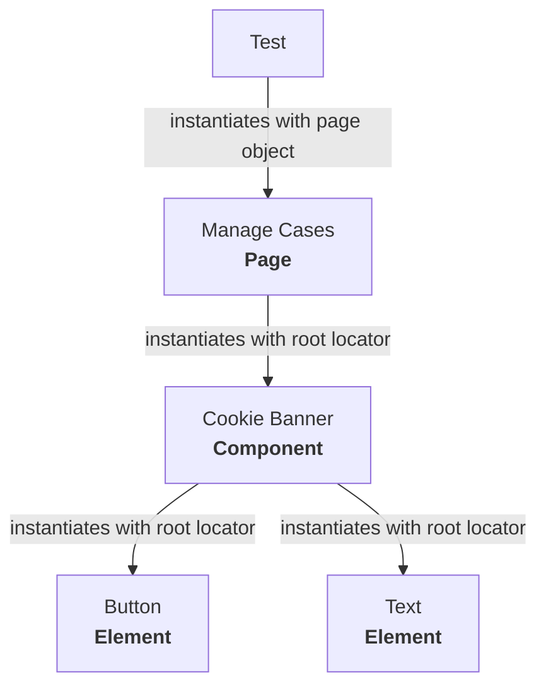

# Page Object Model

A page object model (POM) is typical design pattern in test automation with the aim of reducing code duplication and maintenance. Implmentations of POM's can vary and this doc aims to explain how the POM works in this template.

## Structure

The POM structure is made up as below:

```sh
├── page-objects/            # Page objects
├──── components/            # Common components shared across pages
├──── elements/              # Common elements that could be found in a page or in a component
├──── pages/                 # Unique pages that may contain their own locators
```

### Elements

Elements can exist on multiple components. These typically boil down to the raw HTML elements such as inputs, raw text and buttons etc. Sometimes it can be useful to have an element class that allows you to store logic related to specific elements separately.

For example with checkboxes you may want to store locators, custom assertions or handling logic. You can then refer to this class rather than duplicating the code for each test.

### Components

Components can exist on multiple pages, they are mostly made up of elements or could also include other components. Likewise with elements, you may also want to store handling logic or custom assertions for components.

A common example of this within HMCTS is the "cookie banner". This component can appear on every page and is made up of text elements and buttons.

### Pages

Finally, pages are essentially made up of elements are components. You may also choose to store unique locators in these pages as well (if they are not part of a component). These will be at a higher level than elements or components and should mostly be kept lightweight.

## How to combine Elements, Components and Pages

Using the above examples, we could model it like so:



Then for example, your test using the page (as a fixture) can inherit any components or elements that are used in that page.
See example [here](https://github.com/hmcts/tcoe-playwright-example/blob/master/playwright-e2e/tests/case-list-professional.spec.ts#L28)

## Base Page

In addition to the above, there is a ["base page"](https://github.com/hmcts/tcoe-playwright-example/blob/master/playwright-e2e/page-objects/base.ts). This acts as a parent to the other pages where they also inherit the "page" object e.g. [here](https://github.com/hmcts/tcoe-playwright-example/blob/master/playwright-e2e/page-objects/components/cui/cui-case-list.component.ts#L17) a benefit of this is that you can avoid declaring locators inside the constructor and instead make the locators a class property instead.
